# Maine Lakes Monitoring — Environmental Research Platform Case Study

> Production environmental data platform for exploring Maine lake monitoring data through geospatial maps, per-lake dashboards, time-series charts, satellite indicators, model outputs, forecasts, comparison workflows, and research exports.


**Live platform:** [lakesmonitoring.com](https://lakesmonitoring.com)

---

## Overview

Maine Lakes Monitoring is a full-stack environmental research web application that turns fragmented lake-monitoring datasets and scientific outputs into one interactive interface: geospatial maps, per-lake dashboards, time-series charts, satellite-derived indicators, hydrodynamic model outputs, weather forecasts, comparison workflows, and research exports.

My work focused on the production web application: UX/UI, Angular frontend, FastAPI backend/API, MongoDB data access, dashboard workflows, map-based interaction, charts, filtering, exports, and deployment support.

I integrated scientific datasets and model outputs into a production Angular/FastAPI/MongoDB web application.

The scientific algorithms, machine-learning research, remote-sensing methodology, and hydrodynamic/modeling work were developed by the research/scientific team or provided through existing research data pipelines. My role was to expose those datasets and outputs through usable web workflows for researchers and lake stakeholders.

| | |
|---|---|
| **Type** | Environmental research platform / data dashboard / geospatial web application |
| **Role** | Web Application Architect & Full-Stack Developer |
| **Project context** | Dr. Ofir Tal’s research project, University of Maine, School of Marine Sciences |
| **Status** | Production at [lakesmonitoring.com](https://lakesmonitoring.com) |
| **Application stack** | Angular 17 · TypeScript · Angular Material · deck.gl · MapLibre GL · ECharts · FastAPI · MongoDB |
| **Integrated research outputs** | Field records · lake polygons · satellite-derived indicators · GLM model outputs · NOAA GFS forecasts |

---

## Impact / Scale

| Metric | Value |
|---|---:|
| Maine lake polygons | 2,807 |
| Field records | 82,628 |
| Satellite observations | 13M+ |
| Field-record history | 54 years |
| Environmental indicators | ~15 |
| Data providers / source families | 7–8 |
| Core analytical workflows | ~6 |

These figures show that the platform is not a simple dashboard. It integrates field records, satellite observations, geospatial data, lake polygons, hydrodynamic model outputs, and weather forecasts into a production research interface.

---

## Problem

Freshwater lake monitoring creates a difficult data problem. Field measurements, satellite observations, model outputs, lake boundaries, weather forecasts, and research exports often live in separate files, portals, scripts, or agency datasets.

That makes it hard for researchers and lake managers to compare indicators, study long-term change, inspect spatial patterns, review model/forecast outputs, or communicate findings to non-technical stakeholders.

The research team needed one unified interface where users could:

1. Explore Maine lakes spatially.
2. Open a per-lake dashboard.
3. Compare water-quality indicators over time.
4. Review satellite-derived indicators.
5. Inspect model and forecast outputs.
6. Export data for research workflows.

---

## What Was Built

| Capability | Detail |
|---|---|
| Interactive geospatial map | 2,807 shoreline-accurate Maine lake polygons |
| Field data dashboards | 82,628 field records spanning decades of monitoring |
| Water-quality parameters | Secchi depth, chlorophyll-a, total phosphorus, dissolved oxygen, pH, alkalinity, color, conductivity |
| Satellite indicators | Surface temperature, chlorophyll-a, CDOM, TSM, diffuse attenuation from Landsat and Sentinel missions |
| Satellite observations | 13M+ observations aggregated across Landsat and Sentinel-2/3 |
| Model outputs | GLM 1-D hydrodynamic outputs for thousands of lakes |
| Weather forecast layer | NOAA GFS 96-hour rolling meteorological forecasts |
| Cross-lake comparison | Ranked views and spatial heatmaps for environmental analysis |
| Data export | Filtered export workflows for research use |

---

## Architecture

The platform was built as a production web application around scientific datasets and model outputs produced by the research workflow.

```text
Research datasets / satellite-derived outputs / GLM outputs / forecasts / lake polygons
→ MongoDB collections and application data model
→ FastAPI backend/API
→ Angular 17 web application
→ map exploration, lake dashboards, charts, comparison workflows, forecasts, and exports
```

My implementation focused on the application layer:

- UX/UI structure for researchers and lake stakeholders.
- Angular frontend for map exploration, dashboards, charts, comparison views, and exports.
- FastAPI backend/API for serving lake-level and workflow-specific data.
- MongoDB data access and application-oriented data modeling.
- Integration of scientific datasets and model outputs into production web workflows.
- Production deployment/support of the web platform.

The scientific algorithms, machine-learning experiments, remote-sensing methodology, and lake-physics modeling were outside my direct implementation scope. The web application consumed and exposed those outputs through usable research workflows.

For a deeper walkthrough of the key technical decisions — heterogeneous data integration behind a single API, separating the processing pipeline from the serving layer, and polygon-first spatial query design — see [docs/architecture.md](docs/architecture.md).

---

## Technical Challenges

### 1. Heterogeneous environmental data

The platform needed to combine field measurements, satellite-derived indicators, lake polygons, hydrodynamic model outputs, and weather forecasts.

**Solution:** design API/data-access workflows and application data structures that expose prepared field records, satellite-derived outputs, model outputs, forecasts, and lake polygons through map, dashboard, chart, and export workflows.

### 2. Spatial lake exploration

Users needed to explore lakes geographically rather than only through tables or files.

**Solution:** build an interactive geospatial interface around shoreline-accurate lake polygons, map selection, lake-level details, and spatial comparison workflows.

### 3. Time-series and indicator comparison

Researchers needed to compare indicators across time, lakes, and data sources.

**Solution:** implement per-lake dashboards, time-series chart workflows, ranked comparison views, and spatial heatmaps.

### 4. Forecast and model integration

The platform needed to expose model outputs and NOAA GFS forecasts in a way that was usable inside the web interface.

**Solution:** integrate model and forecast outputs into lake-level views and analytical workflows instead of leaving them as external files.

### 5. Research usability

The platform needed to serve researchers and lake stakeholders without requiring them to write scripts.

**Solution:** design UI workflows for map exploration, charting, comparison, filtering, and export.

---

## Tech Stack

### Web application stack implemented

| Layer | Technology |
|---|---|
| Frontend | Angular 17, TypeScript, Angular Material |
| Geospatial UI | deck.gl, MapLibre GL, lake-polygon rendering |
| Charts | Apache ECharts / ngx-echarts |
| Backend API | FastAPI, Uvicorn, Pydantic, PyMongo |
| Database | MongoDB |
| Data access / API layer | Lake records, field measurements, satellite outputs, GLM outputs, forecasts |
| UX / workflows | Map explorer, lake dashboards, time-series views, cross-lake comparison, filtering, exports |
| Deployment | Production web deployment at lakesmonitoring.com |

### Research/scientific inputs integrated

| Input type | Source / context |
|---|---|
| Field records | Maine lake monitoring datasets |
| Spatial data | HydroLAKES-derived lake polygons, OpenStreetMap context |
| Satellite-derived indicators | Landsat and Sentinel-derived outputs |
| Model outputs | GLM lake-physics outputs |
| Forecasts | NOAA GFS weather forecast outputs |
| Scientific processing / ML | Developed outside my scope by the research/scientific side or existing research pipelines |

---

## Screenshots

### Map Explorer


Interactive map for exploring Maine lake polygons, selecting lakes, switching base maps/layers, and opening lake-level environmental data.

### Lake Dashboard — Overview

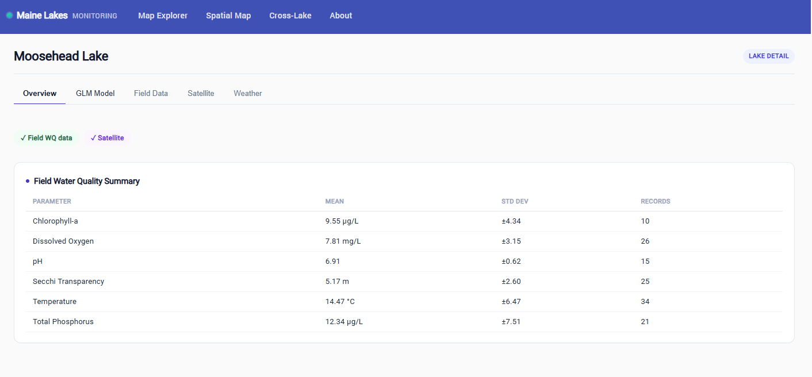

Lake-level overview combining field water-quality summaries, satellite availability, and lake context.

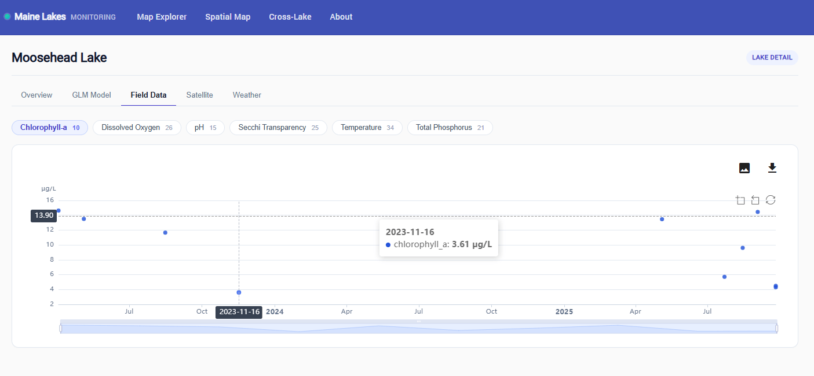

Additional lake-level dashboard view showing available monitoring categories and researcher-facing navigation.

### Lake Dashboard — Spatial Context

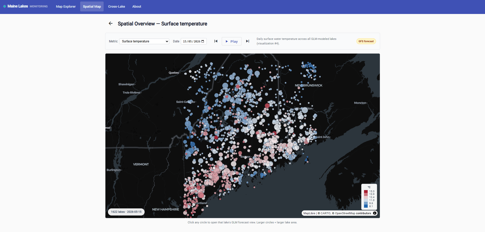

Spatial lake context view showing shoreline geometry and map-based lake selection.

### Lake Dashboard — Field, Satellite, and Forecast Views

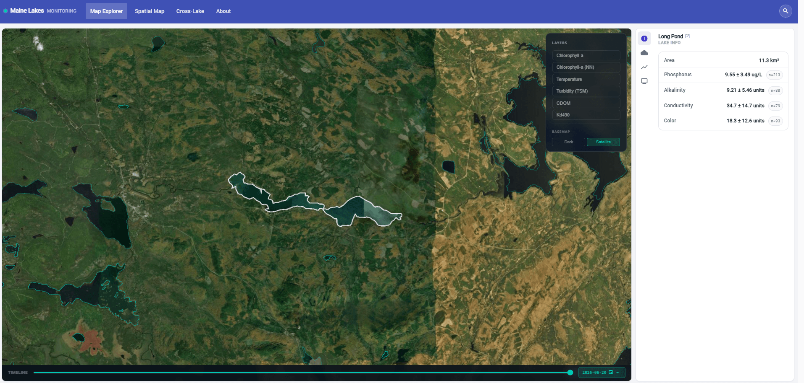

Field-data dashboard for reviewing lake-level water-quality measurements.

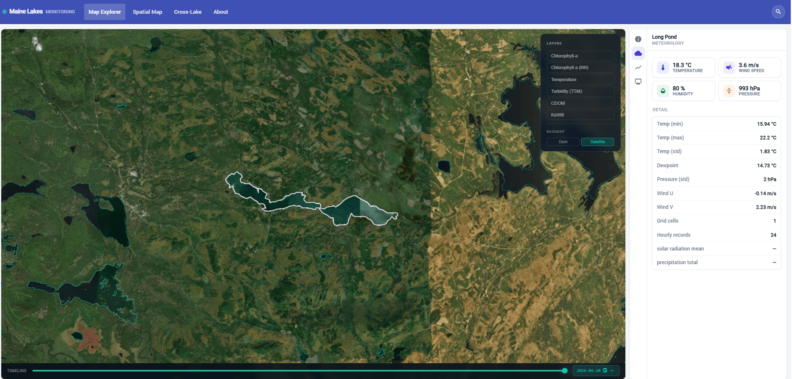

Meteorology view exposing lake-level weather and forecast-related values through the web application.

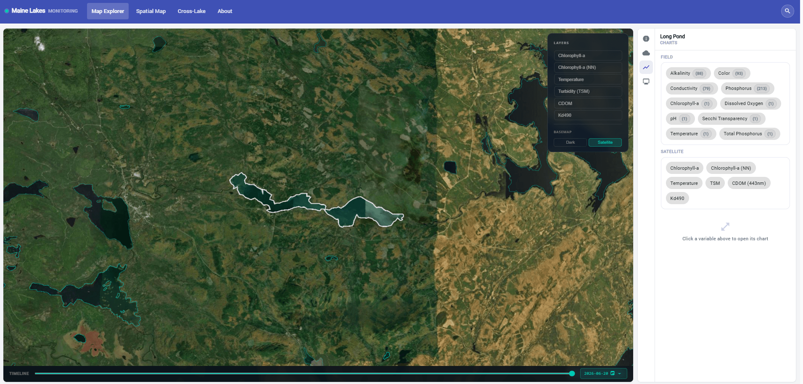

Chart workflow for selecting field and satellite indicators for lake-level analysis.

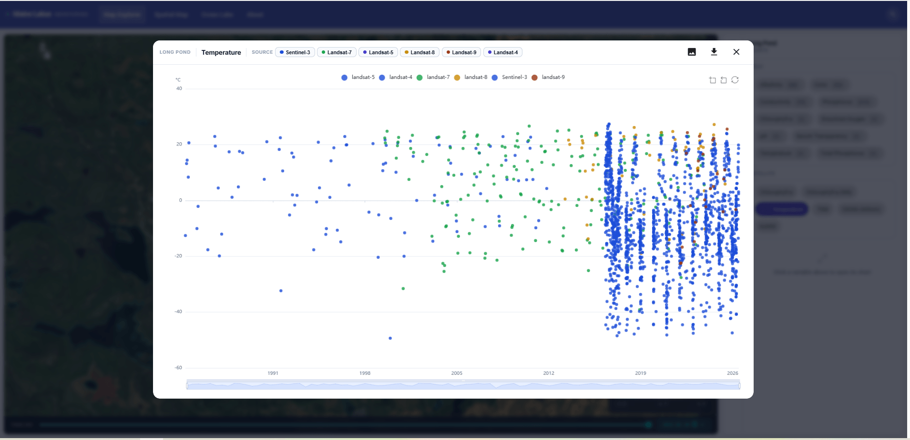

Satellite-derived time-series charts exposed through the lake dashboard.

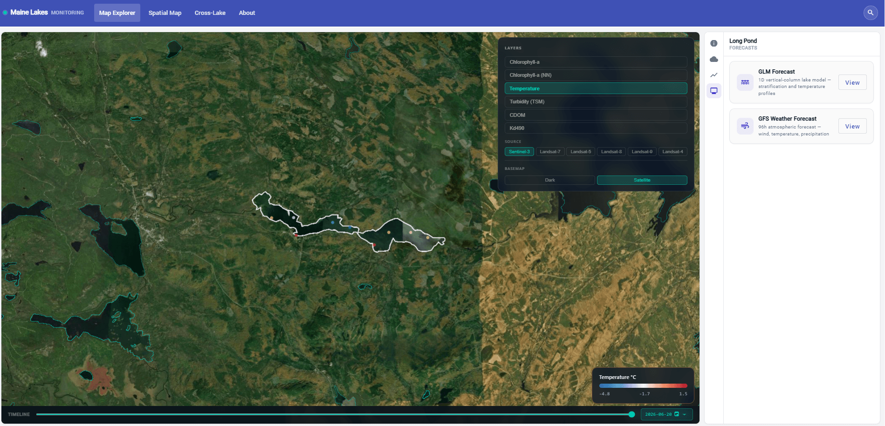

Forecast dashboard showing GLM and NOAA GFS forecast workflows available from the lake-level interface.

### Time-Series Charts

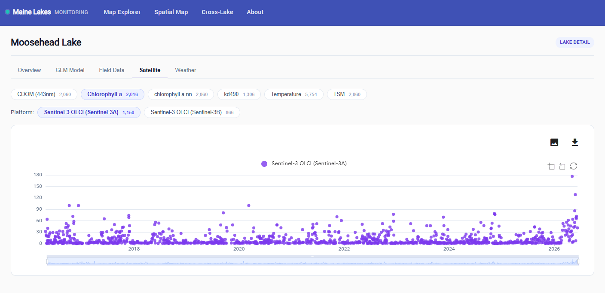

Time-series workflows for comparing environmental indicators across field records, satellite products, and model outputs.

### Cross-Lake Comparison

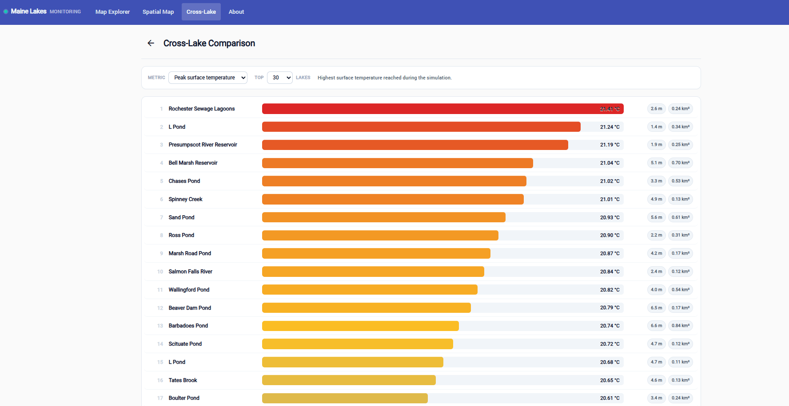

Ranked comparison and spatial analysis workflow for comparing lakes and indicators.

### Forecast / Weather View

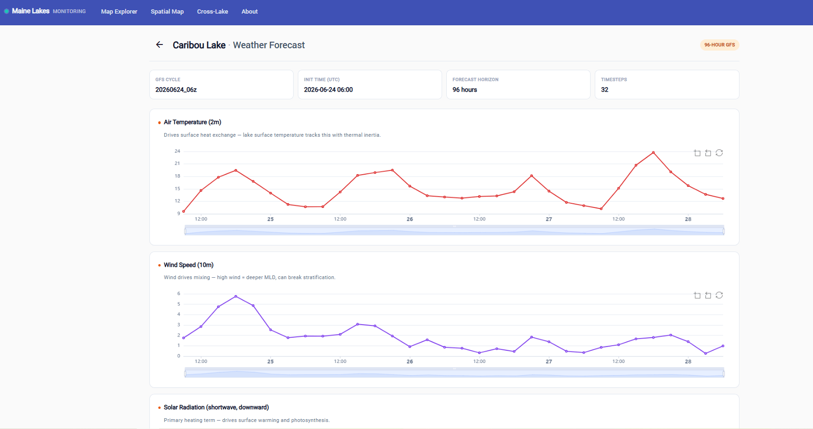

Forecast and meteorological data exposed through lake-level web workflows, including 96-hour GFS forecast views.

### Data Export

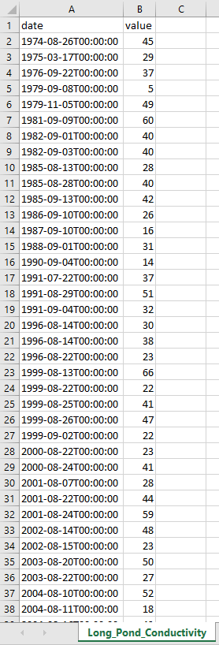

Filtered export workflow for downstream research and analysis.

---

## Results

- Production platform deployed and live at [lakesmonitoring.com](https://lakesmonitoring.com).
- 2,807 Maine lake polygons available through an interactive geospatial interface.
- 82,628 field records integrated into per-lake dashboard and time-series workflows.
- 13M+ satellite observations queryable across Landsat and Sentinel missions.
- Hydrodynamic model outputs and 96-hour NOAA GFS forecasts available through web workflows.
- Researchers can compare field data, satellite indicators, model outputs, and forecasts without writing code.
- Built in collaboration with Dr. Ofir Tal and Prof. Emmanuel Boss; credited on the live platform for full-stack web application architecture and platform development.

---

## What This Demonstrates

This case study demonstrates the ability to turn complex scientific datasets and model outputs into a usable production web application: map-based exploration, lake-level dashboards, time-series charts, cross-lake comparison, forecast views, filtering, exports, and production deployment.

It also demonstrates clear scope separation: the scientific algorithms and modeling work came from the research/scientific side, while my work focused on UX/UI, Angular frontend architecture, FastAPI backend/API, MongoDB data access, workflow design, and web-platform delivery.

---

## Relevance

This project demonstrates:

- Full-stack research platform development.
- Angular/TypeScript frontend architecture.
- Python/FastAPI backend and application data-access workflows.
- MongoDB-backed environmental data modeling.
- Geospatial map-based UI development.
- Time-series charting and data-heavy dashboard workflows.
- Integration of field records, satellite products, model outputs, and forecasts.
- Research-focused UX for non-developer users.
- Production deployment of a scientific data product.

---

Built by [Ben Ben-Tzion](https://github.com/benbentzion) · [Web Appli](https://web-appli.web.app) · Live platform: [lakesmonitoring.com](https://lakesmonitoring.com)
