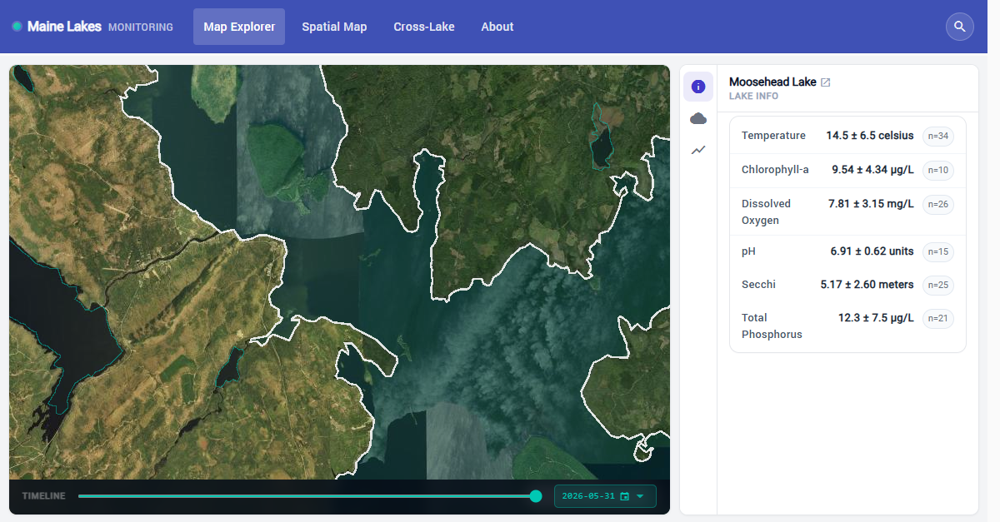

# Maine Lakes Monitoring — Case Study

> Production environmental research platform for water-quality monitoring across Maine lakes.

**Live platform:** [lakesmonitoring.com](https://lakesmonitoring.com)

---

## Overview

Maine Lakes Monitoring is a full-stack research platform that turns fragmented lake-monitoring data into one interactive interface: geospatial maps, per-lake dashboards, time-series charts, satellite-derived indicators, hydrodynamic model outputs, and weather forecasts — all accessible to researchers and lake stakeholders without writing code.

| | |
|---|---|
| **Type** | Research platform / data dashboard / geospatial system |
| **Role** | Fullstack Architect & Platform Developer |
| **Client** | Dr. Ofir Tal's research project, University of Maine, School of Marine Sciences |
| **Status** | Production at [lakesmonitoring.com](https://lakesmonitoring.com) |
| **Stack** | Angular · TypeScript · Python · FastAPI · MongoDB · MapLibre GL · Deck.gl · ECharts |

---

## Problem

Freshwater lake monitoring creates a difficult data problem. Field measurements, satellite observations, model outputs, lake boundaries, and weather forecasts live in separate files, portals, scripts, or agency databases. That makes it hard for researchers and lake managers to compare indicators, study long-term change, or communicate findings to non-technical stakeholders.

The research team needed a unified platform: one interface where users could explore Maine lakes spatially, open a per-lake dashboard, compare water-quality indicators over time, review satellite-derived values, inspect hydrodynamic model outputs, and export data for scientific work.

---

## What Was Built

| Capability | Detail |
|---|---|
| Interactive geospatial map | 2,807 shoreline-accurate Maine lake polygons |
| Field data dashboards | 82,628 field records spanning decades of monitoring |
| Water-quality parameters | Secchi depth, chlorophyll-a, total phosphorus, dissolved oxygen, pH, alkalinity, color, conductivity |
| Satellite indicators | Surface temperature, chlorophyll-a, CDOM, TSM, diffuse attenuation from Landsat and Sentinel missions |
| Satellite observations | 13M+ aggregated across Landsat and Sentinel-2/3 |
| Model outputs | GLM 1-D hydrodynamic outputs for thousands of lakes |
| Weather forecast layer | NOAA GFS 96-hour rolling meteorological forecasts |
| Cross-lake comparison | Ranked views and spatial heatmaps for environmental analysis |
| Data export | Filtered export workflows for research use |

---

## Tech Stack

| Layer | Technology |
|---|---|
| Frontend | Angular 17, TypeScript, Angular Material |
| Backend | Python, FastAPI |
| Database | MongoDB |
| Mapping | MapLibre GL, Deck.gl |
| Spatial data | HydroLAKES-derived lake polygons, OpenStreetMap |
| Charts | Apache ECharts (ngx-echarts) |
| Data sources | Maine field records, Landsat, Sentinel-2/3, NOAA GFS, GLM model outputs |
| Data processing | Python geospatial and scientific-data pipelines |
| Deployment | Production web deployment, containerized |

---

## Architecture Decisions

See [docs/architecture.md](docs/architecture.md) for a walkthrough of the key technical decisions — heterogeneous data integration, spatial query design, and separating the data processing pipeline from the data serving layer.

---

## Results

- Production platform deployed and live at [lakesmonitoring.com](https://lakesmonitoring.com)
- 2,807 Maine lake polygons navigable through an interactive geospatial interface
- 82,628 field records integrated into per-lake time-series dashboards
- 13M+ satellite observations queryable across Landsat and Sentinel missions
- Hydrodynamic model outputs and 96-hour weather forecasts available per lake
- Researchers can compare field data, satellite indicators, model outputs, and forecasts through a web interface — no code required
- Built in collaboration with Dr. Ofir Tal (University of Maine) and Prof. Emmanuel Boss; Ben credited as Fullstack Architect & Platform Developer on the live platform

---

*Built by [Ben Ben-Tzion](https://github.com/benbentzion) · [Web Appli](https://web-appli.web.app)*
